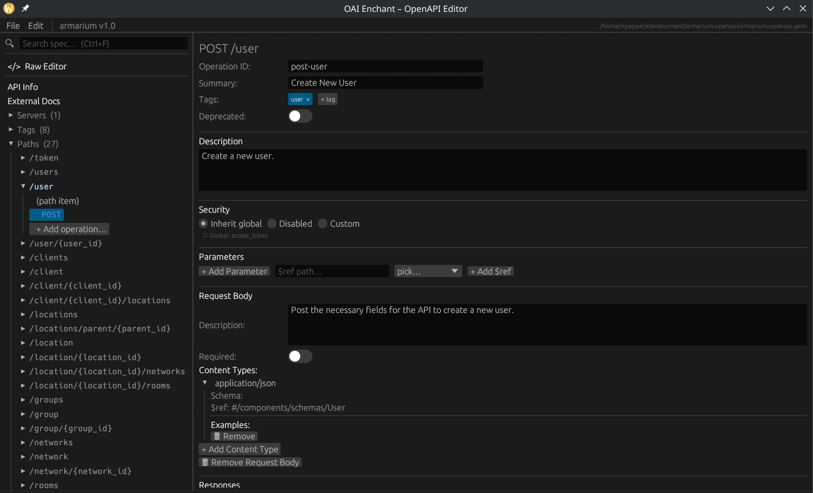
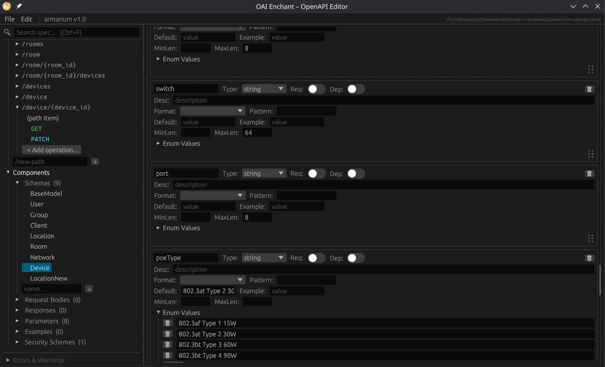

# OAI Enchant

A native desktop OpenAPI specification editor built with Rust and [egui](https://github.com/emilk/egui), supporting OpenAPI versions up to 3.2.  This program was written with Claude Code using the entry level plan over a couple of weeks.  The intent was to work on both Linux and Windows.  I have not tried to get it working on Macs as I don't own one.  

With the current state of OpenAPI tools there was no free and open editor for doing the down and dirty editing of specifications.  I had a need for this and was sick of trying to use Stoplight Studio which was only somewhat useful and was extremely slow with features that I didn't care for.  Not to mention that they decided to go closed source and remove all trace of the project on Github.

This project is not meant for users who know nothing about API specification generation and is strictly a power user program.  In my opinion, the most important part of a client/server program is the communication specification.  Hence this program was born, so I could edit the specs for the programs I was working on.



## Features

- **Full specification tree** — sidebar navigation covering paths, operations, components (schemas, request bodies, responses, parameters, examples, headers, security schemes), servers, tags, and external docs
- **Operation editor** — edit operation ID, summary, description, tags (via chip selector), deprecated toggle, parameters, request body (with content types), and responses
- **Schema editor** — supports regular and composition schemas (allOf / anyOf / oneOf) with inline and `$ref` entries; per-property controls for type, format, pattern, default, example, min/max length, required, and deprecated toggles



- **Raw text editor** — view and edit the spec as YAML or JSON with syntax highlighting; parse-and-apply writes changes back to the in-memory model
- **Inline linter** — errors and warnings displayed in the sidebar, covering missing titles, broken `$ref` pointers, missing operationIds, undeclared tags, path-parameter mismatches, duplicate operationIds, and more
- **Drag-to-reorder** — reorder schema properties via a drag handle
- **Editable paths** — rename path strings directly in the path item editor; the sidebar and selection update automatically
- **New/Open/Save/Save As** — YAML and JSON round-trip via `serde_yaml` / `serde_json`; dirty-state indicator in the title bar

## Building

Requires a recent stable Rust toolchain.

```sh
cargo build --release
```

The binary is written to `target/release/oai-enchant`.

## Running

```sh
cargo run --release
```

On launch, create a new specification or open an existing YAML/JSON file via **File → Open…**.

## Dependencies

| Crate | Version | Purpose | License |
|---|---|---|---|
| `eframe` | 0.29.1 | Native GUI application shell (window, event loop, persistence) | MIT / Apache-2.0 |
| `egui` | 0.29.1 | Immediate-mode GUI widgets and layout | MIT / Apache-2.0 |
| `egui_extras` | 0.29.1 | Extra egui widgets; SVG rendering for the app icon | MIT / Apache-2.0 |
| `serde` | 1.0 | Serialization/deserialization derive macros and traits | MIT / Apache-2.0 |
| `serde_json` | 1.0 | JSON serialization and deserialization | MIT / Apache-2.0 |
| `serde_yaml` | 0.9 | YAML serialization and deserialization | MIT / Apache-2.0 |
| `indexmap` | 2.0 | Order-preserving hash map for paths and components | MIT / Apache-2.0 |
| `rfd` | 0.14 | Native file open/save dialogs | MIT |

## License

MIT
