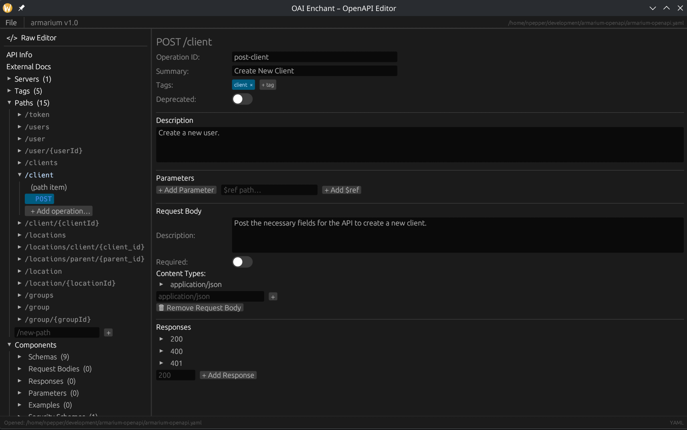
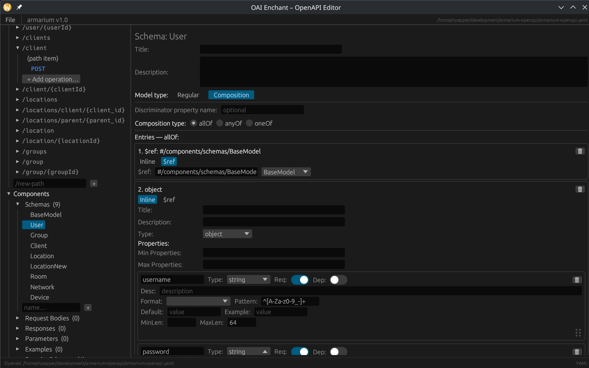

# OAI Enchant

A native desktop OpenAPI specification editor built with Rust and [egui](https://github.com/emilk/egui), supporting OpenAPI versions up to 3.2.



## Features

- **Full specification tree** — sidebar navigation covering paths, operations, components (schemas, request bodies, responses, parameters, examples, headers, security schemes), servers, tags, and external docs
- **Operation editor** — edit operation ID, summary, description, tags (via chip selector), deprecated toggle, parameters, request body (with content types), and responses
- **Schema editor** — supports regular and composition schemas (allOf / anyOf / oneOf) with inline and `$ref` entries; per-property controls for type, format, pattern, default, example, min/max length, required, and deprecated toggles



- **Raw text editor** — view and edit the spec as YAML or JSON with syntax highlighting; parse-and-apply writes changes back to the in-memory model
- **Inline linter** — errors and warnings displayed in the sidebar, covering missing titles, broken `$ref` pointers, missing operationIds, undeclared tags, path-parameter mismatches, duplicate operationIds, and more
- **Drag-to-reorder** — reorder schema properties via a drag handle
- **Editable paths** — rename path strings directly in the path item editor; the sidebar and selection update automatically
- **New/Open/Save/Save As** — YAML and JSON round-trip via `serde_yaml` / `serde_json`; dirty-state indicator in the title bar

## Building

Requires a recent stable Rust toolchain.

```sh
cargo build --release
```

The binary is written to `target/release/oai-enchant`.

## Running

```sh
cargo run --release
```

On launch, create a new specification or open an existing YAML/JSON file via **File → Open…**.

## Dependencies

| Crate | Purpose |
|---|---|
| `eframe` / `egui` | Native GUI framework |
| `serde` + `serde_json` + `serde_yaml` | Serialization |
| `indexmap` | Order-preserving maps for paths and components |
| `rfd` | Native file dialogs |

## License

MIT
